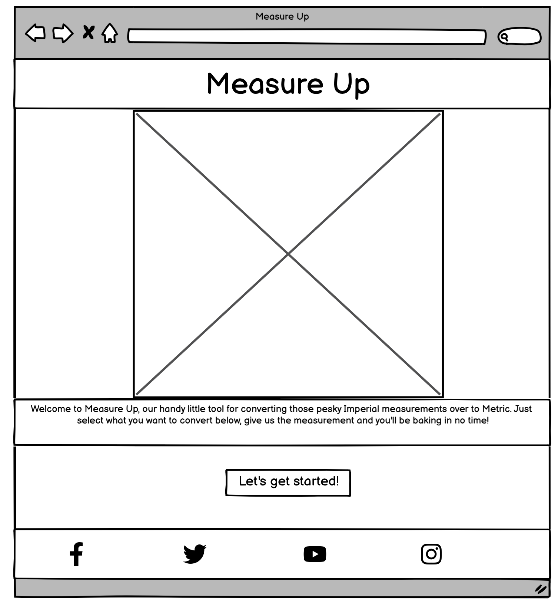
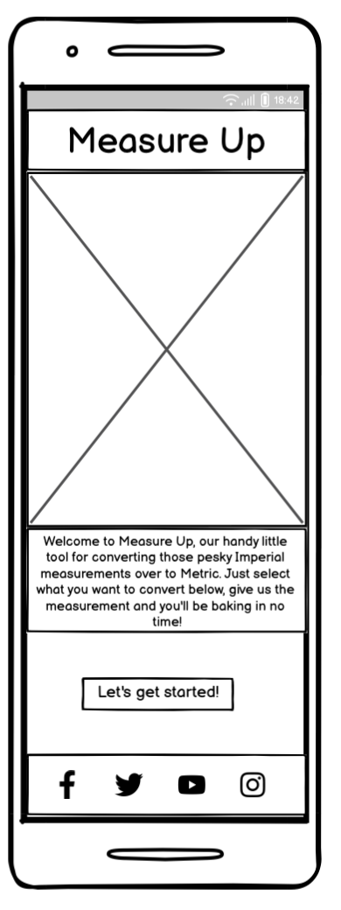
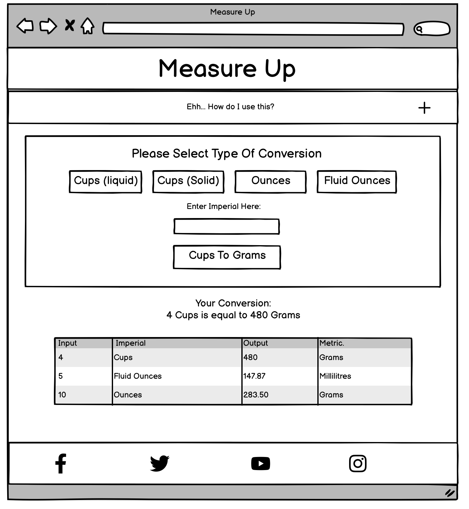
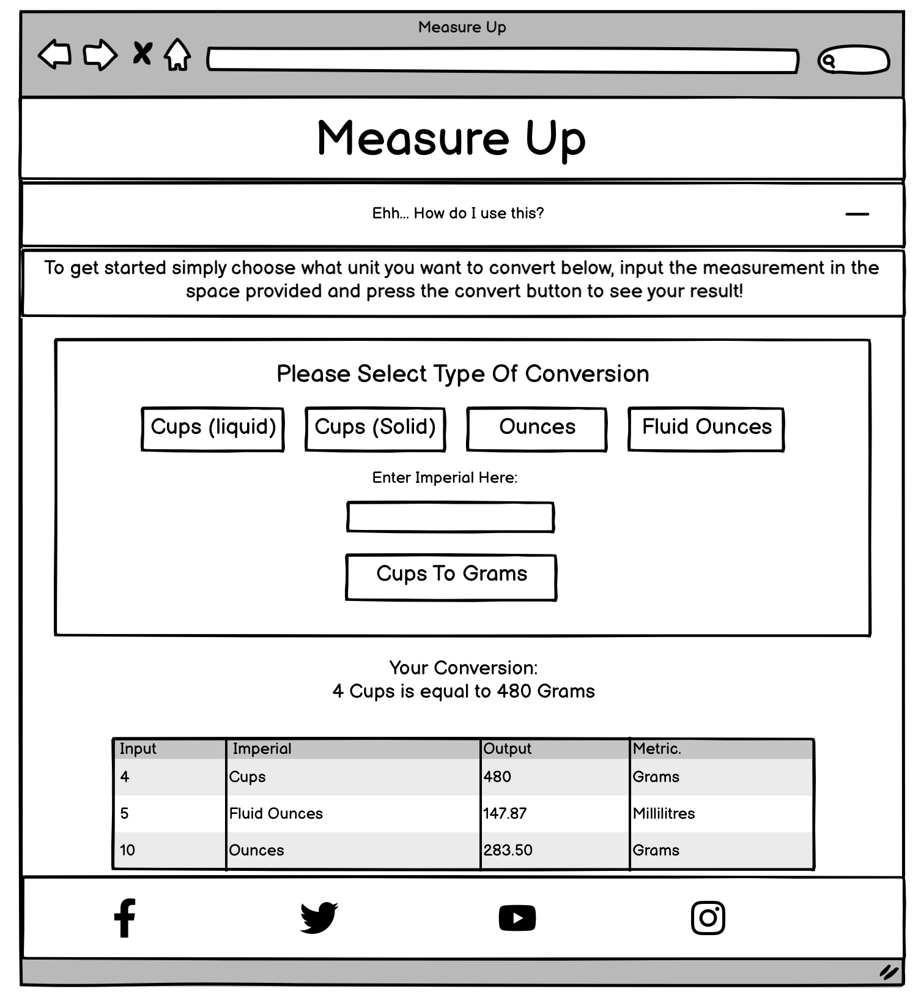
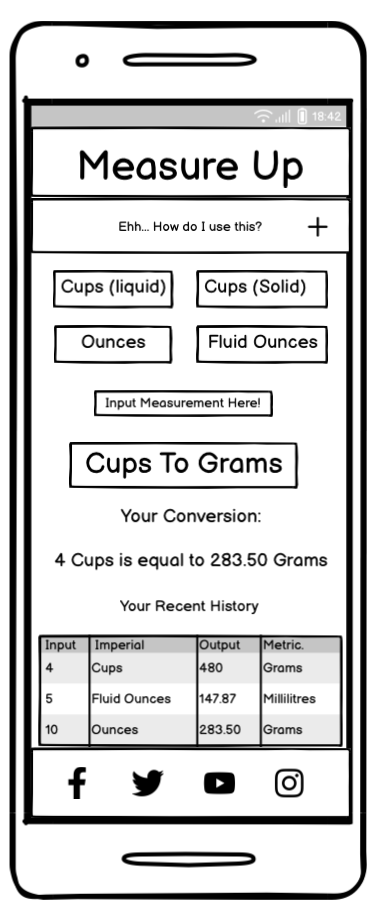
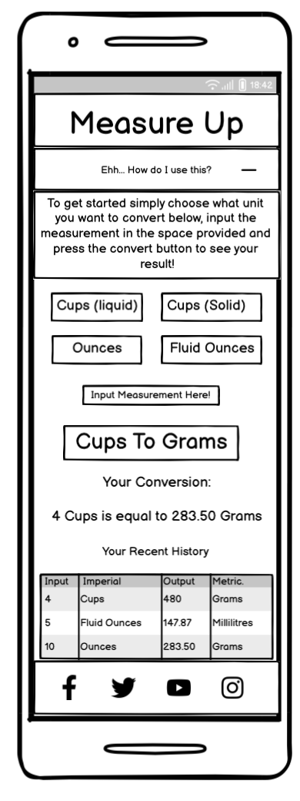
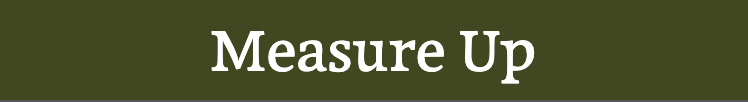
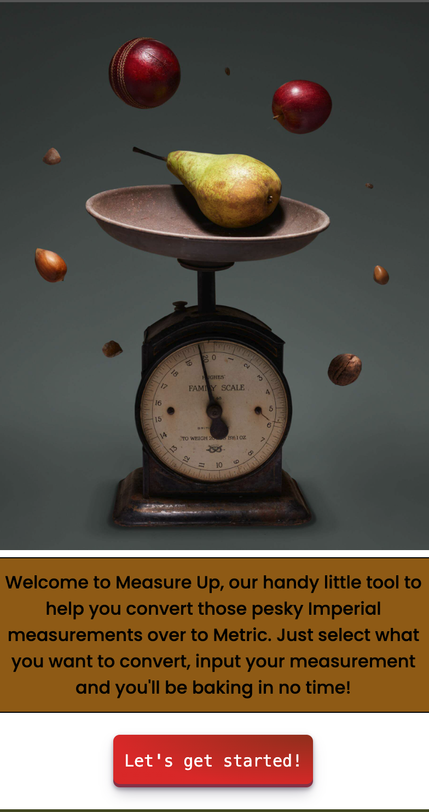
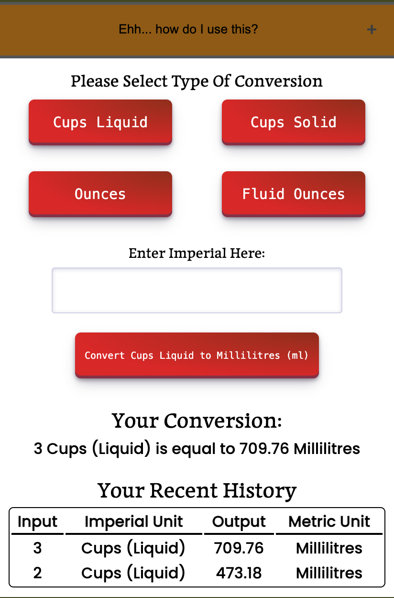

# Measure Up

Measure Up is a tool to help people transfer Imperial measurements over to Metric.

It is useful for helping bakers, both at home and professional, transfer recipes ingredients over to a system of measurement that they are more used to. 

The website is easy to navigate and logs a history so the user can look back over the conversions they carried out.

Visit te deployed site [here](https://snappyjumper.github.io/Measure-Up/).

## Table of Contents

1. [User Experience (UX)](#user-experience-ux)
    1. [Project Goals](#project-goals)
    2. [User Stories](#user-stories)
    3. [Colour Scheme](#colour-scheme)
    4. [Typography](#typography)
    5. [Wireframes](#wireframes)
2. [Features](#features)
3. [Technologies Used]()
    1. [Languages Used]()
    2. [Frameworks, Libraries and Programs Used]()
4. [Testing]()
    1. [Testing User Stories]()
    2. [Code Validation]()
    3. [Accessibility]()
    4. [Tools Testing]()
    5. [Manual Testing]()
5. [Finished Product]()
6. [Deployment]()
    1. [GitHub Pages]()
7. [Credits]
    1. [Content]()
    2. [Media]()
    3. [Code]()
8. [Acknowledgements]()

***

## User Experience (UX)

### Project Goals

* The website provides a structure that is both easy to understand and to navigate.

* Has a neat appearance but also colourful enough to give a friendly tone.

* Has a welcome screen to inform the user how to opperate the tool.

* Has a responsive design accessible across a range of devices.

* Prints the result in an easy to read format.

* Writes a history of conversions to a table so the user can look back over their previous calculations.

### User Stories

* As a user, I want the website to be easy to navigate.

* As a user, I want the tool to be easy to use.

* As a user, I want the results to be clear and easy to understand.

* As a user, I want the website to save a history of what I have converted.

* As a user, I want to be able to access this tool on different devices.

### Colour Scheme

The colours used throughout the project are as follows: 

* #FFFFFF for the heading text

* #000000 for the boarders and the main body text

* #4A5123 for the background colour of the header and footer. Also in the box shadow colour of the workspace on larger screens.

* #996515 for the background colour of the welcome message and in the accordion tab. Also found in the buttons and input box, when interacted with, and as part of the box shadow colour of the workspace on larger screens.

* #9A351E for the start, conversion and submit buttons as part of a radial-gradient. Also in the hovers for the social media links.

* #DD2D2D for the start, conversion and submit buttons as part of a radial-gradient.

* #606060 for the box shadow on the header and the accordion tab.

* #fff and #D6D6E7 are found in the input box

The shades of green and gold add a feel of elegance to the site, while the shades of red add a nice contrast and make the buttons stand out.

### Typography

The main font used in the site is Poppins from Google Font with a back up of sans-serif, should it fail to load. Maname, also from Google Fonts, is used for all headings and subheadings including the logo. It is backed up by serif should it fail to load.

### Wireframes

[Balsamiq] (https://balsamiq.com/) was the software used to generate wireframe mock-ups of the site and to demonstrate the placement of the elements within the page.

Page | Desktop | Mobile
--- | --- | ---
Welcome Page |  | 
Tool Section (Accordion Tab Undeployed and Deployed)|   |  

[Back to top ^](#measure-up)

## Features 

### General

* The website was designed from a mobile first perspective.

* Design is responsive across all device sizes

* **Header**

    - The header contains the logo which is also an anchor tag to the page. The header sits on top of the main content of the site in a fixed position.

* **Footer**

    - The footer contains links to social media sites. The sites are displayed as icons. The footer sits at the bottom of the main content.

* **Main Content**
 

