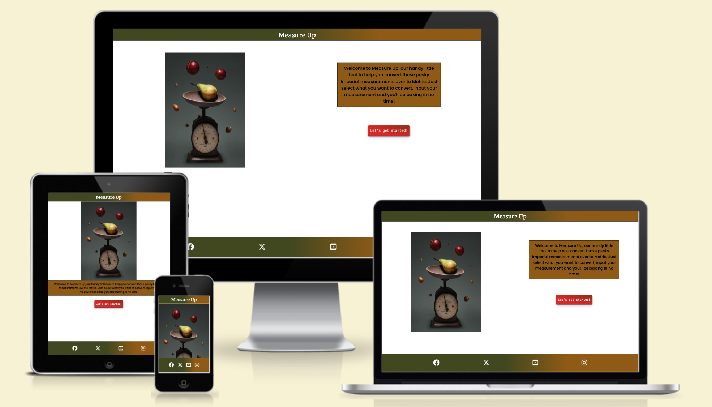
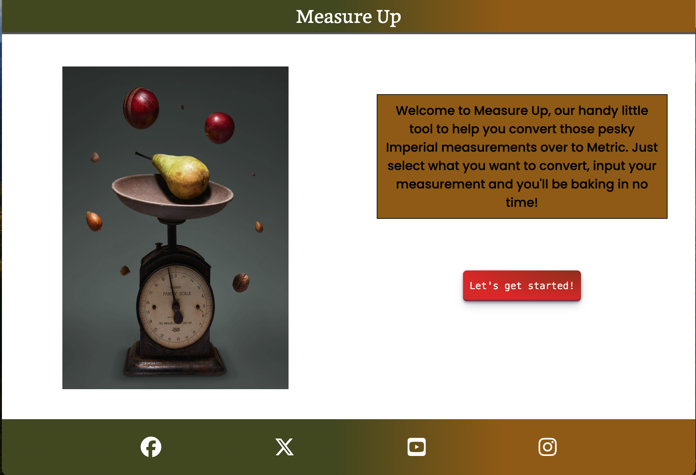

# Measure Up

Measure Up is a tool to help people transfer Imperial measurements over to Metric.

It is useful for helping bakers, both at home and professional, transfer recipes ingredients over to a system of measurement that they are more used to. 

The website is easy to navigate and logs a history so the user can look back over the conversions they carried out.

Visit the deployed site [here](https://snappyjumper.github.io/Measure-Up/).

## Table of Contents

1. [User Experience (UX)](#user-experience-ux)
    1. [Project Goals](#project-goals)
    2. [User Stories](#user-stories)
    3. [Colour Scheme](#colour-scheme)
    4. [Typography](#typography)
    5. [Wireframes](#wireframes)
2. [Features](#features)
    1. [General](#general)
    2. [Welcome Screen](#welcome-screen)
    3. [Tool Screen](#tool-screen)
3. [Technologies Used](#technologies-used)
    1. [Languages Used](#languages-used)
    2. [Libraries, Frameworks and Programs Used](#libraries-frameworks-and-programs-used)
4. [Testing](#testing)
    1. [Testing User Stories](#testing-user-stories)
    2. [Code Validation](#code-validation)
    3. [Accessibility](#accessibility)
    4. [Tools Testing](#tools-testing)
    5. [Manual Testing](#manual-testing)
5. [Finished Product]()
6. [Deployment]()
    1. [GitHub Pages]()
7. [Credits]
    1. [Content]()
    2. [Media]()
    3. [Code]()
8. [Acknowledgements]()

***

## User Experience (UX)

### Project Goals

* The website provides a structure that is both easy to understand and to navigate.

* Has a neat appearance but also colourful enough to give a friendly tone.

* Has a welcome screen to inform the user how to opperate the tool.

* Has a responsive design accessible across a range of devices.

* Prints the result in an easy to read format.

* Writes a history of conversions to a table so the user can look back over their previous calculations.

### User Stories

* As a user, I want the website to be easy to navigate.

* As a user, I want the tool to be easy to use.

* As a user, I want the results to be clear and easy to understand.

* As a user, I want the website to save a history of what I have converted.

* As a user, I want to be able to access this tool on different devices.

### Colour Scheme

The colours used throughout the project are as follows: 

* #FFFFFF for the heading text

* #000000 for the boarders and the main body text

* #4A5123 for the background colour of the header and footer. Also in the box shadow colour of the workspace on larger screens.

* #996515 for the background colour of the welcome message and in the accordion tab. Also found in the buttons and input box, when interacted with, and as part of the box shadow colour of the workspace on larger screens.

* #9A351E for the start, conversion and submit buttons as part of a radial-gradient. Also in the hovers for the social media links.

* #DD2D2D for the start, conversion and submit buttons as part of a radial-gradient.

* #606060 for the box shadow on the header and the accordion tab.

* #fff and #D6D6E7 are found in the input box

The shades of green and gold add a feel of elegance to the site, while the shades of red add a nice contrast and make the buttons stand out.

### Typography

The main font used in the site is Poppins from Google Font with a back up of sans-serif, should it fail to load. Maname, also from Google Fonts, is used for all headings and subheadings including the logo. It is backed up by serif should it fail to load.

### Wireframes

[Balsamiq](https://balsamiq.com/) was the software used to generate wireframe mock-ups of the site and to demonstrate the placement of the elements within the page.

Page | Desktop | Mobile
--- | --- | ---
Welcome Page |  | 
Tool Section (Accordion Tab Undeployed and Deployed)|   |  

[Back to top ^](#measure-up)

## Features 

### General

* The website was designed from a mobile first perspective.

* Design is responsive across all device sizes

* **Header**

    - The header contains the logo which is also an anchor tag to the page. This is useful should the user wish to navigate back to the welcome screen. 
    
    - The header sits on top of the main content of the site in a fixed position. This allows the user easy access from anywhere on the page

* **Accordion Tab**

    - Tab Closed

    

    - Tab Open

    
    
    - On the tool screen there is a accordion tab. 

    - When active the panel under the tab displays information on how to use the conversion tool.

    - The panel slides in and out of view when the tab is clicked on and the symbol on the right of the tab changes from + to -.

* **Unit Buttons**

    - Active

    

    - Inactive

    

    - The buttons for selecting your starting unit have been styled so that they are responsive to being clicked on.

    - When the button is pressed it raises up afterwards and the colour changes around its edge.

    - When pressed again it returns to its previous appearance.

* **Submit Button**

    - Fluid Ounces selected

    

    - Ounces selected

    

    - The Submit Button is styled in the same way as the Unit Buttons.

    - The text inside the submit button changes depending on what unit button you have selected.

* **Input Box**

    - Input Box in focus

    

    - Input Box no focus

    

    - The input box highlights when it is in focus

    - After a conversion is complete or a new unit selected the previous input is deleted from the input box and the focus is pulled back to the input box. This is useful so the user doesn’t have to keep clicking on the box everytime. 

* **Output Area and History Table**

    - Table before inputs

    

    - Table after inputs

    

    - The Output gets printed directly to the DOM and is overwritten every time there is a new input calculated.

    - Previous calculations get stored on a history table. This is useful when the user needs to look back over the calculations they've already done.

* **Footer**

    - The footer contains links to social media sites displayed as icons. 

    - The social media Icons highlight when the cursor is hovered over them.

    - Clicking one of the links will open the corresponding site in a separate tab. This is useful for easy navigation back to the Measure Up page.

### Welcome Screen

* Mobile

* Desktop

* **Hero Image**

    - The hero image was selected because scales have everything to do with the purpose of the site.

    - The image is elegant and simple which complements the design of the site.

* **Start Button**

    - The start button's purpose is to alter the page so that it displays the tool screen.

    - The start button is styled to stand out against the rest of the page and is inviting to press.

### Tool Screen

* Mobile

* Desktop

* **Unit And Submit Buttons**

    - The styles of the buttons on the tool page were chosen to stand out and be enticing to press for the user.

    - The layout of the buttons change on larger media devices to better use the extra space.

* **Input Box**

    - The input box is placed to the centre of the screen to better draw the users focus.

    - The width of the box changes to better suit the larger media devices.

[Back to top ^](#measure-up)

## Technologies Used

### Languages Used
* [HTML5](https://en.wikipedia.org/wiki/HTML5)
* [CSS3](https://en.wikipedia.org/wiki/CSS)
* [JavaScript](https://en.wikipedia.org/wiki/JavaScript)

### Libraries, Frameworks and Programs Used

* [Google Fonts](https://fonts.google.com/)
    - Google Fonts was used to import the Poppins and Maname fonts to the style.css file. These two fonts were then used throughout the site.

* [Font Awesome](https://fontawesome.com/)
    - Font Awesome was used to add icons to the site. These helped to create a better user experience.

* [Balsamiq](https://balsamiq.com/)
    - Balsamiq was the software used to construct the wireframes for the project in its design stage.

* [GitPod](https://gitpod.io/)
    - GitPod was used to write the code, commit it and push it to GitHub.

* [GitHub](https://github.com/)
    - GitHub was used to store the project in repositories after pushing.

* [Am I Responsive?](http://ami.responsivedesign.is/#)
    - Am I responsive was used to see the responsive design throughout the building of the project and to generate mockup imagery to be used in the readme file.

* [Chrome DevTools](https://developer.chrome.com/docs/devtools/)
    - Chrome DevTools was used throughout the development process to review code and test the responsiveness of the site.

* [W3C Markup Validator](https://validator.w3.org/)
    - W3C Markup Validator was used to validate the HTML code used in the site.

* [W3C CSS Validator](https://jigsaw.w3.org/css-validator/)
    - W3C CSS Validator was used to validate the CSS code used in the site.

* [JSHint](https://jshint.com/)
    - JSHint's JavaScript Code Quality Tool was used to validate the JavaScript used in the site.

* [Favicon.io](https://favicon.io/)
    - Favicon.io was used to generate the sites favicon.

[Back to top ^](#measure-up)

## Testing

### Testing User Stories

* As a user, I want the website to be easy to navigate.

    - The website is focused to two pages to make it easy to navigate.

    - Buttons on the site stand out so the user knows where to click next.

    - The site has instructions on each page to help the user to take the next step.

* As a user, I want the tool to be easy to use.

    - The tool itself is easy to use, with instructions throughout and a help tab if the user is stuck.

    - User history is automatically presented on the screen so the user only has to convert a measurement once.

* As a user, I want the results to be clear and easy to understand.

    - Results are printed on the screen in an easy to read format with clear indication of which measurement is which.

    - The history table displays all its data in a nice easy to read table.

* As a user, I want the website to save a history of what I have converted.

    - The site saves your previous conversions to a convienient table.

* As a user, I want to be able to access this tool on different devices.

    - The site is responsive across a range of devices.

### Code Validation

* The [W3C Markup Validator](https://validator.w3.org/) and [W3C CSS Validator](https://jigsaw.w3.org/css-validator/) tools were used to validate the HTML and CSS code respectively, ensuring there were no syntax errors.

    - W3C Markup Validator Result 1
    
    

        - The validator recommended that I add some section headings to the HTML to help identify the individual sections so I added them.

        - The validator also told me that I had unnecessary roles on my buttons so I removed them.

    - W3C Markup Validator Result 2
    
    

        - After corrections validator resulted in no errors.

    - W3C CSS Validator Result 1
    

        - The validator pointed out a couple of instances i had used commas in my code where I shouldn't have. I removed them.

    - W3C CSS Validator Result 2
    

        - After corrections the validator resulted in no errors.

* The [JSHints JavaScript Code Quality Tool](https://jshint.com/) was used to validate the JavaScript in the site.

    - JSHints Result 1
    

        - The validation warned me about functions calling an outer scoped variable could lead to confusion in semantics. I decided this wasn't a major issue in this project so I took no action.

        - There were a few missing semi-colons in the code. I corrected this issue.

    - JShins Result 2
    

        - After corrections there were no major issues with the code.

### Accessibility

* Lighthouse in Chrome DevTools was used to confirm that the colours and fonts in the site were easy to read and accessible.

* Lighthouse Report

    

### Tools Testing

* [Chrome DevTools](https://developer.chrome.com/docs/devtools/) Chrome DevTools was used throughout the duration of the project to test and modify the HTML and CSS code.

* Responsiveness 

    - Chrome Devtools was used during development to check the responsiveness across a range of devices.

    - [Am I Responsive?](http://ami.responsivedesign.is/#) was used to test the responsiveness across a range of devices during development.

### Manual Testing